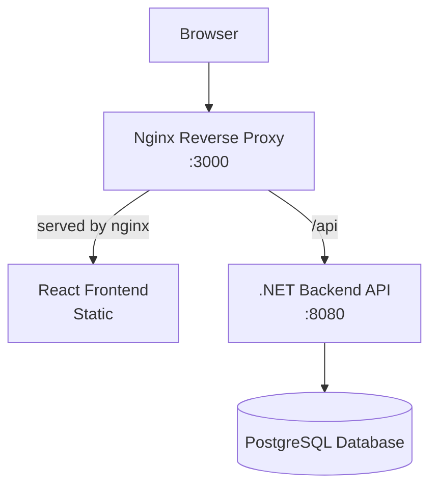
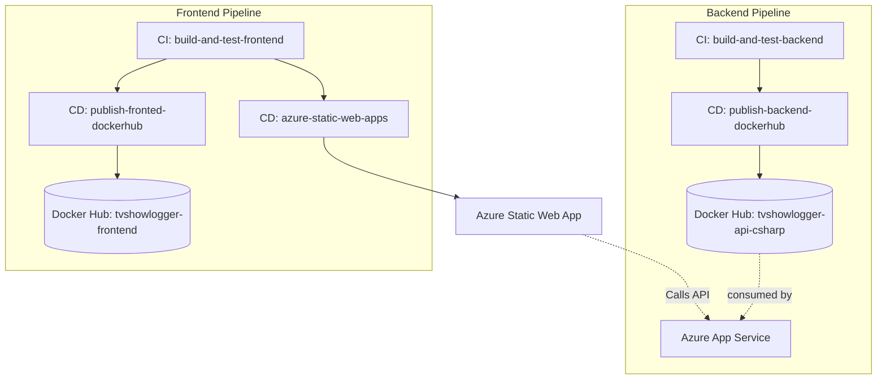

# Codecool bootcamp Jan-Feb 2026
[](https://github.com/nikolaihg/Experis-Codecool-Team-Project/actions/workflows/build-and-test-backend.yml)
[](https://github.com/nikolaihg/Experis-Codecool-Team-Project/actions/workflows/build-and-test-frontend.yml)
[](https://github.com/nikolaihg/Experis-Codecool-Team-Project/actions/workflows/publish-backend-dockerhub.yml)
[](https://github.com/nikolaihg/Experis-Codecool-Team-Project/actions/workflows/publish-fronted-dockerhub.yml)
[](https://github.com/nikolaihg/Experis-Codecool-Team-Project/actions/workflows/azure-static-web-apps-yellow-moss-0111d9403.yml)

Goal: Develop a fullstack application with .NET, React, PostgreSQL  
Development is done in an agile style with 4 planned sprints and a linked github project page for this specific repo: [Experis-Codecool-team-project](https://github.com/users/nikolaihg/projects/2)

## Getting Started
### Prerequisites
- .NET SDK 10
- Node.js & npm/pnpm
- Docker & Docker Compose (for containerized development)
- PostgreSQL client (optional, for direct database access)

### Tech Summary
- **Frontend**: React (Vite)
- **Backend**: ASP.NET Core (.NET 10) REST API
- **Database**: PostgreSQL (Entity Framework Core)
- **Reverse Proxy**: NGINX
- **AUTH**: JWT
- **Monorepo structure**: shared root folder with .env file
- **Docker**: Everything is dockerized and compose for easy running
- **Tooling**: Node.js. npm/pnpm. .NET SDK 10

## Environment Setup
### Backend
Backend uses `dotnet user-secrets` for local development. Run these commands to set up your local secrets:
```bash
# 1. Navigate to the API project
cd backend/Api

# 2. Initialize user secrets (if not already done)
dotnet user-secrets init

# 3. Set PostgreSQL connection string (adjust username/password as needed)
dotnet user-secrets set "ConnectionStrings:DefaultConnection" "Host=localhost;Port=5432;Database=tvshowlogger;Username=postgres;Password=postgres"

# 4. Set JWT Signing Key (must be at least 32 characters)
dotnet user-secrets set "Jwt:SigningKey" "REPLACE_WITH_A_VERY_LONG_SECRET_KEY_FOR_LOCAL_DEV"
```

### Frontend
The frontend connects to the backend API.
- **Local Dev**: Defaults to `http://localhost:5173` (Vite).
- **Docker**: Served via Nginx at `http://localhost:3000`.

### Docker Compose
#### Diagram


#### Running
Docker Compose uses the `.env.docker` file in the root directory for configuration.

1. Create your docker environment file:
   ```bash
   cp .env.docker.example .env.docker
   ```
2. Open `.env.docker` and update the values:
   - `POSTGRES_USER`, `POSTGRES_PASSWORD`, `POSTGRES_DB`
   - `Jwt__SigningKey` (Required for the API container)

3. Run the application:
   ```bash
   docker compose --env-file .env.docker up --build
   ```

**Ports:**
- **Frontend (Nginx):** `http://localhost:3000` (Main entry point)
- **API (Direct):** `http://localhost:8080` (For debugging)
- **PostgreSQL:** `localhost:5432`

> **Note:** We are exposing port 8080 (API) directly for development and debugging convenience. In a production environment, this port would typically be closed, and all traffic would be routed through the Nginx reverse proxy on port 3000.

## Development with PostgreSQL Only

For faster development iteration, run just the PostgreSQL container and run the .NET backend and Frontend locally.
- `dotnet run /backend/Api`
- `npm run dev /frontend`


## Deployment Flow
This repository uses GitHub Actions for CI and release automation of frontend and backend artifacts.



1. Code changes trigger scoped CI workflows based on changed paths (`backend/**` or `frontend/**`).
2. Docker publish workflows create versioned images (`latest`, tag, and SHA) and sign images with Cosign.
3. Frontend is deployed to Azure Static Web Apps via the Azure workflow.
4. Backend deployment target (Azure App Service) pulls a published backend image as part of the infrastructure/runtime process.

## Project Documentation
The `project-documentation` folder contains planning material, architecture notes, diagrams, and references used during development.

- API proposal: [project-documentation/api-refactor-proposal.md](project-documentation/api-refactor-proposal.md)
- Brainstorming notes: [project-documentation/brainstorming.md](project-documentation/brainstorming.md)
- OpenAPI snapshot: [project-documentation/openapi-18-02-26.json](project-documentation/openapi-18-02-26.json)
- Class diagram draft: [project-documentation/diagrams/classv2.txt](project-documentation/diagrams/classv2.txt)
- System diagram draft: [project-documentation/diagrams/systemdiagram.txt](project-documentation/diagrams/systemdiagram.txt)
- Presentation assets: [project-documentation/presentations](project-documentation/presentations).
