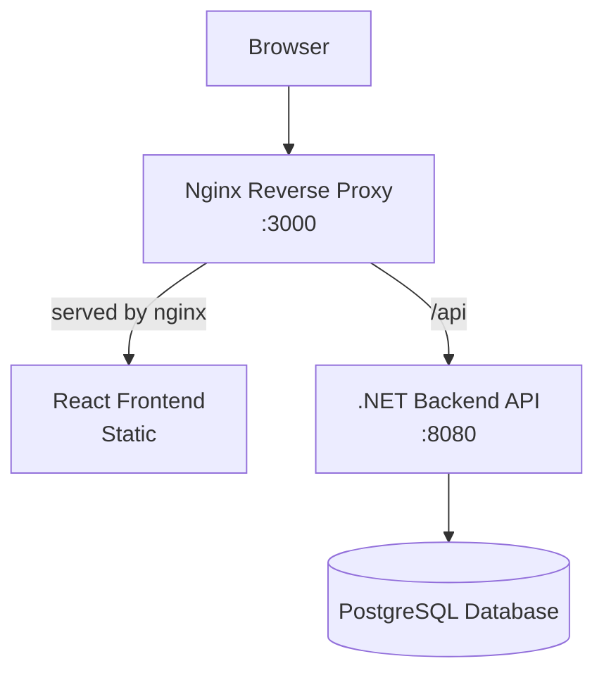

# Codecool bootcamp Jan-Feb 2026
Goal: Develop a fullstack data-driven application with .NET, React, PostgreSQL  
Development is done in an agile style with 4 planned sprints and a linked github project page for this specific repo: [Experis-Codecool-team-project](https://github.com/users/nikolaihg/projects/2)

## Getting Started
### Prerequisites
- .NET SDK 10
- Node.js & npm/pnpm
- Docker & Docker Compose (for containerized development)
- PostgreSQL client (optional, for direct database access)

### Tech Summary
- **Frontend**: React (Vite)
- **Backend**: ASP.NET Core (.NET 10) REST API
- **Database**: PostgreSQL (Entity Framework Core)
- **Reverse Proxy**: NGINX
- **AUTH**: JWT
- **Monorepo structure**: shared root folder with .env file
- **Docker**: Everything is dockerized and compose for easy running
- **Tooling**: Node.js. npm/pnpm. .NET SDK 10

## Environment Setup
### Backend
Backend uses `dotnet user-secrets` so if you have cloned this project run: 
```bash
# 1. init
cd backend/Api
dotnet user-secrets init
# 2. Set postgres connection string
dotnet user-secrets set "ConnectionStrings:DefaultConnection" "Host=localhost;Port=5432;Database=tvshowlogger;Username=YOURUSERNAME;Password=YOURPASSWORD"
# 3. Set JWT signingKey
dotnet user-secrets set "Jwt:SigningKey" "SUPERLONGSECRETKEYDONTSHAREMIN32CHARS"
# 4. Change issuer and audience in ./backend/Api/appsettings.Docker.json if you want to change these
```

### Frontend
Vite defaults to `localhost:5173` but this is configurable via `./frontend/.env.example` if needed.
### Docker Compose
#### Diagram


#### Running
Docker compose uses an environment file called `.env.docker` located in root.  
So start by `cp .env.docker.example .env.docker` and fill out your secrets if you want to use docker compose. 
Then run the containers using:  
```bash
docker compose --env-file .env.docker up --build
```
Ports: 
- The API will be available at `http://localhost:8080` 
- PostgreSQL at `http://localhost:5432`
- Nginx reverse proxy (Frontend) at `http://localhost:3000`

> **Note:** We are exposing port 8080 (API) directly for development and debugging convenience. In a production environment, this port would typically be closed, and all traffic would be routed through the Nginx reverse proxy on port 3000.

## Development with PostgreSQL Only

For faster development iteration, run just the PostgreSQL container and run the .NET backend and Frontend locally.
- `dotnet run /backend/Api`
- `npm run dev /frontend`

## Project documentation
The repo folder `\project-documentation` contains diagrams, notes and other important documents created and gathered while we planned / developed this application.  
- Diagrams: `class-diagram.png`, `system-architecture-diagram.png`, `use-case-diagram.png`,
- Notes: `brainstorming.md`, etc